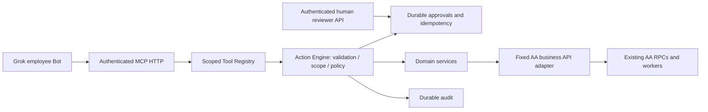

# AA MCP Gateway architecture

Discovery completed before implementation, 2026-09-07, against the local AA Console repository. Local migrations are evidence of source capabilities, not confirmation of deployed database state.

## Existing AA

React 18 / Vite frontend uses Supabase publishable-key sessions and RLS. `profiles.role` distinguishes admin, employee and client; `clients.id` is a UUID. Client membership and employee assignments constrain data access. `agent-runtime` is a separate Node worker with durable Supabase jobs, claim/lease orchestration, and intelligence/content executors. Its HTTP endpoints are `/health`, `/status`, and admin-authenticated `/master/chat`; no local Supabase Edge Functions exist. Intelligence executors are not employee Bot identities.

Business logic resides largely in SQL RPCs and worker modules, not a general AA REST service. Existing review and production workflows must remain authoritative. Do not turn service-role credentials into a way to bypass human-role checks.

## Decision

Independent TypeScript/Node service, own package/lockfile, deployment and Git repository. Initial location is `AA Console/aa-mcp-gateway` due to workspace write scope; recommended final sibling is `/Users/alex/Projects/aa-mcp-gateway`. No imports from the Console and no modifications to its app.

Every call authenticates an individual Bot credential and uses an explicit permission matrix plus client allowlist. Discovery filters permissions and, by default, hides stub (`not_implemented`) contracts so Bots only see tools they can execute. `ActionEngine.call` applies the same filter, so hidden stubs cannot be invoked by name. Set `MCP_DISCOVER_STUBS=true` to expose permitted stubs for local/admin testing; this does not change `/mcp` authentication. Stub definitions remain in the internal registry. Writes require idempotency keys. HIGH/CRITICAL actions require human approval; Bots cannot resolve approvals. Approval payloads are stored privately and bound to the original action. Execution is explicit after approval, rechecks current permissions, and cannot be repeated. Adapter uncertainty is not automatically retried.

SQLite persists control-plane approvals, execution receipts and audit on a mounted volume. This v1 runs a single process/replica; use a shared transactional store before horizontal scaling. A durable execution reservation precedes external effects; a crash leaves an indeterminate action requiring reconciliation, never automatic replay. Audit stores input field names and identifiers, not content or credentials.

## Initial capability boundary

Content is the first integration domain: `ContentService.generateBrief` delegates to a fixed, server-configured AA business endpoint. This adapter is implemented and enabled by AA_INTERNAL_API_URL plus AA_MCP_SERVICE_SECRET. The AA endpoint owns resource authorization, approved-state enforcement, transactional deduplication, queueing, and worker retry safety. It never fabricates briefs or accesses raw tables. Local workflow approval querying is real control-plane functionality; general delivery tasks remain stubbed because AA job assignments are not a generic task API. Unconnected capabilities stay in the registry as stubs and are omitted from default discovery; with `MCP_DISCOVER_STUBS=true` they still return `not_implemented` with a dependency. No finance payment tool is exposed in production; a test-only critical tool proves policy enforcement.

MCP uses the official TypeScript SDK Streamable HTTP transport, stateless per request. Deployment requires TLS at the reverse proxy, explicit allowed Host/Origin, body and rate limits, secret injection, persistent storage and backups. Static per-Bot bearer tokens are the initial machine-auth contract; OAuth discovery/token issuance is outside v1.
